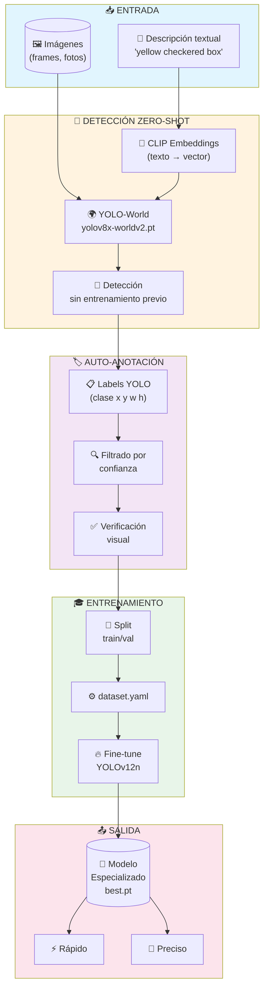
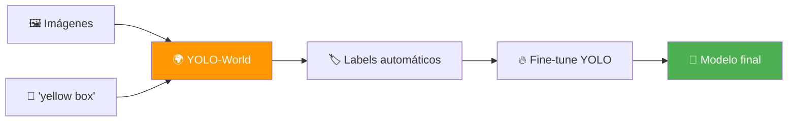
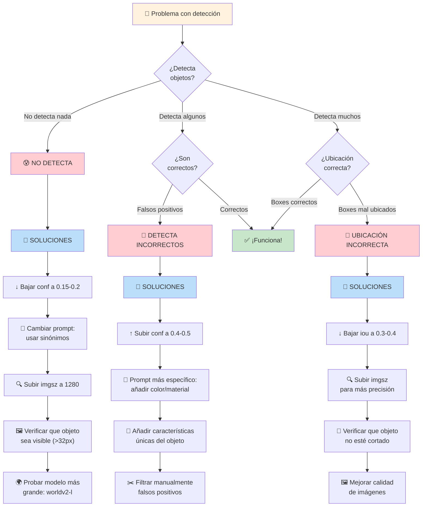

# 📚 Sistema Genérico de Auto-Anotación Zero-Shot

## Material Educativo Completo

---

## 1. 🔄 DIAGRAMA DE FLUJO



### Flujo Simplificado (versión compacta)



---

## 2. 📝 NOTAS MANUSCRITAS (Explicación de Pizarra)

### ¿Qué es Zero-Shot Detection? 🎯

```
┌─────────────────────────────────────────────────────────────────────┐
│                                                                     │
│   ZERO-SHOT = "Cero disparos de entrenamiento"                     │
│                                                                     │
│   Significa: El modelo puede detectar objetos que                  │
│              NUNCA VIO durante su entrenamiento                    │
│                                                                     │
│   ┌──────────────────┐         ┌──────────────────┐                │
│   │  YOLO Clásico    │         │  YOLO-World      │                │
│   ├──────────────────┤         ├──────────────────┤                │
│   │ Solo detecta lo  │         │ Detecta lo que   │                │
│   │ que aprendió     │   VS    │ le DESCRIBAS     │                │
│   │                  │         │                  │                │
│   │ "Conozco 80      │         │ "Descríbeme qué  │                │
│   │  objetos fijos"  │         │  buscas"         │                │
│   └──────────────────┘         └──────────────────┘                │
│                                                                     │
└─────────────────────────────────────────────────────────────────────┘
```

### La Analogía del Policía 👮

```
┌─────────────────────────────────────────────────────────────────────┐
│                                                                     │
│  IMAGINA QUE ERES POLICÍA BUSCANDO A ALGUIEN:                      │
│                                                                     │
│  MÉTODO CLÁSICO (YOLO normal):                                     │
│  ┌────────────────────────────────────────┐                        │
│  │ Te dan un álbum con 80 fotos           │                        │
│  │ Solo puedes encontrar a esas 80        │                        │
│  │ personas específicas                   │                        │
│  │                                        │                        │
│  │ ❌ Nueva persona? No la reconoces      │                        │
│  └────────────────────────────────────────┘                        │
│                                                                     │
│  MÉTODO ZERO-SHOT (YOLO-World):                                    │
│  ┌────────────────────────────────────────┐                        │
│  │ Te dan una DESCRIPCIÓN:                │                        │
│  │ "Hombre alto, barba roja, gorra azul"  │                        │
│  │                                        │                        │
│  │ ✅ Puedes encontrar a CUALQUIERA       │                        │
│  │    que coincida con la descripción     │                        │
│  └────────────────────────────────────────┘                        │
│                                                                     │
└─────────────────────────────────────────────────────────────────────┘
```

### ¿Cómo Funciona la Magia? 🧙

```
┌─────────────────────────────────────────────────────────────────────┐
│                                                                     │
│  EL SECRETO: CLIP (Contrastive Language-Image Pre-training)        │
│                                                                     │
│  CLIP aprendió de MILLONES de pares imagen-texto de internet:      │
│                                                                     │
│    🖼️ [foto de gato]  ←→  📝 "a fluffy cat sitting"               │
│    🖼️ [foto de caja]  ←→  📝 "yellow cardboard box"               │
│    🖼️ [foto de cono]  ←→  📝 "orange traffic cone"                │
│                                                                     │
│  RESULTADO:                                                        │
│  ┌─────────────────────────────────────────────────────────┐       │
│  │                                                         │       │
│  │   TEXTO ───────→ [ENCODER] ───→ Vector 512D            │       │
│  │                                     ↓                   │       │
│  │                                  COMPARAR               │       │
│  │                                     ↑                   │       │
│  │   IMAGEN ──────→ [ENCODER] ───→ Vector 512D            │       │
│  │                                                         │       │
│  │   Si los vectores son SIMILARES = ¡MATCH!              │       │
│  │                                                         │       │
│  └─────────────────────────────────────────────────────────┘       │
│                                                                     │
└─────────────────────────────────────────────────────────────────────┘
```

### ¿Por Qué Necesitamos Fine-Tuning Después? 🤔

```
┌─────────────────────────────────────────────────────────────────────┐
│                                                                     │
│  ANALOGÍA DEL DETECTIVE:                                           │
│                                                                     │
│  YOLO-World es como un DETECTIVE GENERALISTA:                      │
│  ┌────────────────────────────────────────────────────────┐        │
│  │ ✅ Puede encontrar casi cualquier cosa                 │        │
│  │ ✅ Muy versátil                                        │        │
│  │ ❌ Algo lento (modelo grande)                          │        │
│  │ ❌ A veces confunde cosas similares                    │        │
│  │ ❌ No conoce TUS objetos específicos                   │        │
│  └────────────────────────────────────────────────────────┘        │
│                                                                     │
│  El modelo FINE-TUNED es como un ESPECIALISTA:                     │
│  ┌────────────────────────────────────────────────────────┐        │
│  │ ✅ Súper rápido (modelo pequeño)                       │        │
│  │ ✅ Muy preciso para TUS objetos                        │        │
│  │ ✅ Conoce las particularidades de tu caso              │        │
│  │ ❌ Solo detecta lo que entrenaste                      │        │
│  └────────────────────────────────────────────────────────┘        │
│                                                                     │
│  ES COMO:                                                          │
│  "Contrato un detective famoso (YOLO-World) para que               │
│   ENTRENE a mi guardia de seguridad (YOLOv12n) para                │
│   reconocer exactamente lo que necesito"                           │
│                                                                     │
└─────────────────────────────────────────────────────────────────────┘
```

### El Flujo Mental Completo 🧠

```
┌─────────────────────────────────────────────────────────────────────┐
│                                                                     │
│   1. PROBLEMA: Tengo fotos, necesito modelo que detecte algo       │
│                                                                     │
│   2. SOLUCIÓN CLÁSICA (Mala):                                      │
│      └─→ Etiquetar TODO a mano 😫 (horas/días de trabajo)          │
│                                                                     │
│   3. SOLUCIÓN ZERO-SHOT (Buena):                                   │
│      └─→ Describir qué busco → YOLO-World etiqueta por mí 🎉      │
│                                                                     │
│   4. FINE-TUNING:                                                  │
│      └─→ Con etiquetas automáticas entreno modelo pequeño y        │
│          rápido que funciona en tiempo real 🚀                     │
│                                                                     │
│   RESUMEN:                                                         │
│   ┌─────────────────────────────────────────────────────────┐      │
│   │  YOLO-World = Profesor que sabe todo                    │      │
│   │  YOLOv12n   = Estudiante que aprende rápido             │      │
│   │  Tu dataset = El examen específico                      │      │
│   │                                                         │      │
│   │  El profesor le enseña al estudiante exactamente        │      │
│   │  lo que necesita para aprobar TU examen                 │      │
│   └─────────────────────────────────────────────────────────┘      │
│                                                                     │
└─────────────────────────────────────────────────────────────────────┘
```

---

## 3. 📋 GUÍA DE PROMPTS

### Fórmula Universal para Buenos Prompts

```
┌─────────────────────────────────────────────────────────────────────┐
│                                                                     │
│   FÓRMULA:  [COLOR] + [MATERIAL/PATRÓN] + [OBJETO] + [CONTEXTO]    │
│                                                                     │
│   Ejemplos:                                                        │
│   • "yellow checkered box"           (color + patrón + objeto)     │
│   • "orange rubber traffic cone"     (color + material + objeto)   │
│   • "white construction hard hat"    (color + contexto + objeto)   │
│   • "red metal fire extinguisher"    (color + material + objeto)   │
│                                                                     │
└─────────────────────────────────────────────────────────────────────┘
```

### Tabla de Prompts por Tipo de Objeto

#### 📦 Cajas de Colores

| Tipo | ❌ Prompt Malo | ✅ Prompt Bueno | 💡 Por qué funciona |
|------|---------------|-----------------|---------------------|
| Caja amarilla lisa | `box` | `yellow cardboard box` | Color + material específico |
| Caja amarilla checkerboard | `yellow box` | `yellow black checkered box` | Describe el patrón distintivo |
| Caja azul | `blue thing` | `blue plastic storage box` | Material añade contexto |
| Caja verde | `green` | `green rectangular container` | Forma + función |
| Caja roja | `red box` | `red shipping box`, `red crate` | Términos específicos del dominio |

#### 🚧 Señales y Objetos de Tráfico

| Tipo | ❌ Prompt Malo | ✅ Prompt Bueno | 💡 Por qué funciona |
|------|---------------|-----------------|---------------------|
| Cono naranja | `cone` | `orange traffic cone`, `orange safety cone` | Contexto de uso |
| Señal de stop | `sign` | `red octagonal stop sign` | Forma + color distintivo |
| Señal de velocidad | `speed sign` | `white circular speed limit sign` | Forma + color |
| Barrera | `barrier` | `orange white striped road barrier` | Patrón + contexto |
| Señal amarilla | `yellow sign` | `yellow diamond warning sign` | Forma específica |

#### 👷 Equipos de Seguridad (PPE)

| Tipo | ❌ Prompt Malo | ✅ Prompt Bueno | 💡 Por qué funciona |
|------|---------------|-----------------|---------------------|
| Casco | `helmet` | `white construction hard hat`, `yellow safety helmet` | Contexto industrial |
| Chaleco | `vest` | `orange reflective safety vest`, `high visibility vest` | Material reflectante es distintivo |
| Gafas | `glasses` | `clear safety goggles`, `protective eyewear` | Diferencia de gafas normales |
| Guantes | `gloves` | `orange rubber work gloves`, `leather safety gloves` | Material específico |
| Extintor | `extinguisher` | `red fire extinguisher cylinder` | Forma + color |

#### 🏭 Objetos Industriales

| Tipo | ❌ Prompt Malo | ✅ Prompt Bueno | 💡 Por qué funciona |
|------|---------------|-----------------|---------------------|
| Pallet | `pallet` | `wooden shipping pallet`, `blue plastic pallet` | Material diferencia tipos |
| Carretilla | `cart` | `orange pallet jack`, `forklift` | Término técnico correcto |
| Tubería | `pipe` | `yellow gas pipe`, `metal industrial pipe` | Color indica tipo |
| Válvula | `valve` | `red wheel valve`, `industrial gate valve` | Forma distintiva |
| Tanque | `tank` | `white cylindrical storage tank` | Forma + color |

### 🎯 Reglas de Oro para Prompts

```
┌─────────────────────────────────────────────────────────────────────┐
│                                                                     │
│  ✅ SÍ HACER:                                                       │
│  ├─ Usar nombres en INGLÉS (CLIP entrenado en inglés)              │
│  ├─ Incluir COLOR siempre que sea distintivo                       │
│  ├─ Mencionar FORMA si es única (octagonal, cylindrical)           │
│  ├─ Añadir MATERIAL si ayuda (rubber, metal, plastic)              │
│  ├─ Usar PATRONES si existen (checkered, striped, spotted)         │
│  └─ Probar SINÓNIMOS si no funciona (box→crate→container)          │
│                                                                     │
│  ❌ NO HACER:                                                        │
│  ├─ Usar términos demasiado genéricos ("thing", "object")          │
│  ├─ Mezclar idiomas ("yellow caja")                                │
│  ├─ Usar jerga local que CLIP no conoce                            │
│  ├─ Descripciones larguísimas (máx 4-5 palabras)                   │
│  └─ Asumir que el primer prompt funcionará (¡iterar!)              │
│                                                                     │
└─────────────────────────────────────────────────────────────────────┘
```

---

## 4. 📖 EJEMPLOS PASO A PASO

### CASO 1: Detectar Cajas Amarillas con Patrón Checkerboard

#### Paso 1: Preparar Imágenes 📁

```bash
# Estructura recomendada
📁 mi_proyecto/
├── 📁 data/
│   └── 📁 frames/           # Aquí van tus imágenes
│       ├── frame_001.jpg
│       ├── frame_002.jpg
│       └── ...
├── 📁 dataset/              # Aquí se generará el dataset
└── 📄 config.yaml
```

**Checklist de imágenes:**
- [ ] Mínimo 50-100 imágenes (más es mejor)
- [ ] Variedad de ángulos
- [ ] Variedad de distancias (cerca, lejos)
- [ ] Variedad de iluminación
- [ ] El objeto debe ser visible y no muy pequeño (<32px es difícil)

#### Paso 2: Escribir el Prompt ✍️

```yaml
# En tu config.yaml
prompts:
  - "yellow black checkered box"    # Opción principal

# Alternativas si no funciona:
# - "yellow checkerboard pattern box"
# - "black yellow checkered cube"
# - "checkered yellow crate"
```

**Razonamiento del prompt:**
- `yellow black` → Colores distintivos del patrón
- `checkered` → Describe el patrón específico
- `box` → Tipo de objeto

#### Paso 3: Ejecutar Auto-Anotación ⚡

```bash
# Comando básico
python scripts/auto_annotate.py \
    --source data/frames/ \
    --prompts "yellow black checkered box" \
    --output dataset/ \
    --conf 0.3

# Con múltiples prompts alternativos (prueba cuál funciona mejor)
python scripts/auto_annotate.py \
    --source data/frames/ \
    --prompts "yellow black checkered box" "checkered yellow cube" \
    --output dataset/ \
    --conf 0.25
```

#### Paso 4: Verificar Resultados ✅

```bash
# Ver estadísticas
python scripts/verify_annotations.py --dataset dataset/

# Visualizar algunas anotaciones
python scripts/visualize.py --dataset dataset/ --samples 20
```

**Qué revisar:**
- [ ] ¿Detectó la mayoría de objetos? (>70% es aceptable)
- [ ] ¿Los bounding boxes están bien centrados?
- [ ] ¿Hay falsos positivos? (detecta cosas que no son)
- [ ] ¿Hay muchos falsos negativos? (no detecta objetos obvios)

#### Paso 5: Entrenar Modelo Final 🔥

```bash
# Entrenar YOLOv12n con las anotaciones generadas
python scripts/train.py \
    --data dataset/dataset.yaml \
    --model yolo12n.pt \
    --epochs 100 \
    --batch 16 \
    --imgsz 640
```

---

### CASO 2: Detectar 3 Tipos de Objetos Simultáneamente

**Objetos a detectar:**
1. 🟦 Cajas azules
2. 🟧 Conos naranjas
3. 🔴 Señales rojas

#### Paso 1: Configurar Múltiples Clases

```yaml
# config.yaml
prompts:
  - "blue plastic storage box"      # Clase 0
  - "orange traffic safety cone"    # Clase 1
  - "red warning sign"              # Clase 2

class_names:
  - "blue_box"
  - "orange_cone"
  - "red_sign"
```

#### Paso 2: Ejecutar Auto-Anotación Multi-Clase

```bash
python scripts/auto_annotate.py \
    --source data/frames/ \
    --config config.yaml \
    --output dataset/ \
    --conf 0.3
```

#### Paso 3: Verificar Balance de Clases

```bash
# Ver distribución de clases
python scripts/analyze_dataset.py --dataset dataset/

# Output esperado:
# ┌────────────────┬────────┬────────────┐
# │ Clase          │ Count  │ Percentage │
# ├────────────────┼────────┼────────────┤
# │ blue_box       │ 450    │ 35%        │
# │ orange_cone    │ 380    │ 30%        │
# │ red_sign       │ 445    │ 35%        │
# └────────────────┴────────┴────────────┘
```

#### Paso 4: Dataset YAML Generado

```yaml
# dataset/dataset.yaml (generado automáticamente)
path: /home/user/proyecto/dataset
train: images/train
val: images/val

names:
  0: blue_box
  1: orange_cone
  2: red_sign
```

#### Paso 5: Entrenar

```bash
python scripts/train.py \
    --data dataset/dataset.yaml \
    --model yolo12n.pt \
    --epochs 150 \
    --batch 16
```

---

## 5. 📄 CHEATSHEET (1 Página)

```
╔══════════════════════════════════════════════════════════════════════════╗
║                    🎯 YOLO ZERO-SHOT CHEATSHEET                          ║
╠══════════════════════════════════════════════════════════════════════════╣
║                                                                          ║
║  ⚡ COMANDO BÁSICO                                                        ║
║  ┌────────────────────────────────────────────────────────────────────┐  ║
║  │ python scripts/auto_annotate.py \                                  │  ║
║  │     --source data/frames/ \                                        │  ║
║  │     --prompts "tu descripcion aqui" \                              │  ║
║  │     --output dataset/ \                                            │  ║
║  │     --conf 0.3                                                     │  ║
║  └────────────────────────────────────────────────────────────────────┘  ║
║                                                                          ║
║  📝 FÓRMULA PARA PROMPTS                                                 ║
║  ┌────────────────────────────────────────────────────────────────────┐  ║
║  │     [COLOR] + [MATERIAL/PATRÓN] + [OBJETO]                         │  ║
║  │                                                                    │  ║
║  │     Ejemplos:                                                      │  ║
║  │     • "yellow checkered box"                                       │  ║
║  │     • "orange rubber traffic cone"                                 │  ║
║  │     • "red metal fire extinguisher"                                │  ║
║  └────────────────────────────────────────────────────────────────────┘  ║
║                                                                          ║
║  ⚙️ PARÁMETROS IMPORTANTES                                               ║
║  ┌──────────────┬─────────────────────────────────────────────────────┐  ║
║  │ --conf       │ Umbral confianza (0.25-0.5) ↑más=menos detecciones  │  ║
║  │ --iou        │ Umbral NMS (0.5-0.7) ↓menos=menos overlap           │  ║
║  │ --imgsz      │ Tamaño imagen (640, 1280) ↑más=mejor pero lento     │  ║
║  │ --device     │ GPU a usar (0, cpu)                                 │  ║
║  └──────────────┴─────────────────────────────────────────────────────┘  ║
║                                                                          ║
║  🔧 SI NO DETECTA BIEN                                                   ║
║  ┌────────────────────────────────────────────────────────────────────┐  ║
║  │ 1. Bajar --conf a 0.2 o 0.15                                       │  ║
║  │ 2. Probar sinónimos: box→crate→container                          │  ║
║  │ 3. Añadir más descriptores: "bright yellow large box"             │  ║
║  │ 4. Usar imgsz mayor: 1280 en vez de 640                           │  ║
║  └────────────────────────────────────────────────────────────────────┘  ║
║                                                                          ║
║  🚫 SI DETECTA COSAS INCORRECTAS                                         ║
║  ┌────────────────────────────────────────────────────────────────────┐  ║
║  │ 1. Subir --conf a 0.4 o 0.5                                        │  ║
║  │ 2. Ser más específico: "box"→"yellow shipping box"                 │  ║
║  │ 3. Añadir contexto único: patrón, material, forma                  │  ║
║  │ 4. Excluir manualmente los falsos positivos                        │  ║
║  └────────────────────────────────────────────────────────────────────┘  ║
║                                                                          ║
║  ✅ CHECKLIST PRE-ENTRENAMIENTO                                          ║
║  ┌────────────────────────────────────────────────────────────────────┐  ║
║  │ □ Mínimo 100 imágenes por clase                                    │  ║
║  │ □ Objetos visibles (>32px)                                         │  ║
║  │ □ Variedad: ángulos, distancias, luz                               │  ║
║  │ □ Verificar anotaciones visualmente                                │  ║
║  │ □ Split train/val (~80/20)                                         │  ║
║  └────────────────────────────────────────────────────────────────────┘  ║
║                                                                          ║
║  🚀 PIPELINE COMPLETO                                                    ║
║  ┌────────────────────────────────────────────────────────────────────┐  ║
║  │ 1. python scripts/extract_frames.py --video input.mp4             │  ║
║  │ 2. python scripts/auto_annotate.py --source frames/ ...           │  ║
║  │ 3. python scripts/verify_annotations.py --dataset dataset/        │  ║
║  │ 4. python scripts/train.py --data dataset.yaml --epochs 100       │  ║
║  │ 5. python scripts/evaluate.py --model runs/best.pt                │  ║
║  └────────────────────────────────────────────────────────────────────┘  ║
║                                                                          ║
╚══════════════════════════════════════════════════════════════════════════╝
```

---

## 6. 🔍 TROUBLESHOOTING VISUAL



### Tabla de Diagnóstico Rápido

| Síntoma | Causa Probable | Solución Rápida |
|---------|---------------|-----------------|
| 🔴 0 detecciones | conf muy alto o prompt muy genérico | `--conf 0.15` + prompt más específico |
| 🟠 Pocas detecciones | conf alto o objeto pequeño | `--conf 0.25` + `--imgsz 1280` |
| 🟡 Muchos falsos positivos | conf muy bajo o prompt genérico | `--conf 0.45` + prompt único |
| 🟢 Boxes muy grandes | iou muy alto | `--iou 0.4` |
| 🔵 Boxes muy pequeños | objeto parcialmente visible | Usar imágenes donde objeto esté completo |
| 🟣 Detecciones duplicadas | iou muy bajo | `--iou 0.6` |

### Árbol de Decisión para Prompts

```
¿Tu prompt funciona?
│
├─ NO detecta nada
│   └─→ ¿El objeto tiene COLOR distintivo?
│       ├─ SÍ → Añadir color: "yellow box"
│       └─ NO → Añadir forma: "rectangular container"
│
├─ Detecta pero CONFUNDE con otros objetos
│   └─→ ¿Qué lo hace ÚNICO?
│       ├─ Patrón → "checkered", "striped", "spotted"
│       ├─ Material → "metal", "plastic", "rubber"
│       └─ Contexto → "traffic", "safety", "industrial"
│
└─ Detecta CORRECTAMENTE
    └─→ ✅ ¡Listo para entrenar!
```

---

## 🎓 Resumen Final

```
┌─────────────────────────────────────────────────────────────────────────┐
│                                                                         │
│   🌍 YOLO-World = Tu asistente que entiende descripciones              │
│   📝 Buen prompt = Detección precisa                                   │
│   🔥 Fine-tuning = Modelo rápido y especializado                       │
│                                                                         │
│   RECUERDA:                                                            │
│   1. Siempre en inglés                                                 │
│   2. Color + Material + Objeto                                         │
│   3. Iterar hasta que funcione                                         │
│   4. Verificar antes de entrenar                                       │
│                                                                         │
│   ¡El 90% del éxito está en escribir buenos prompts!                   │
│                                                                         │
└─────────────────────────────────────────────────────────────────────────┘
```
